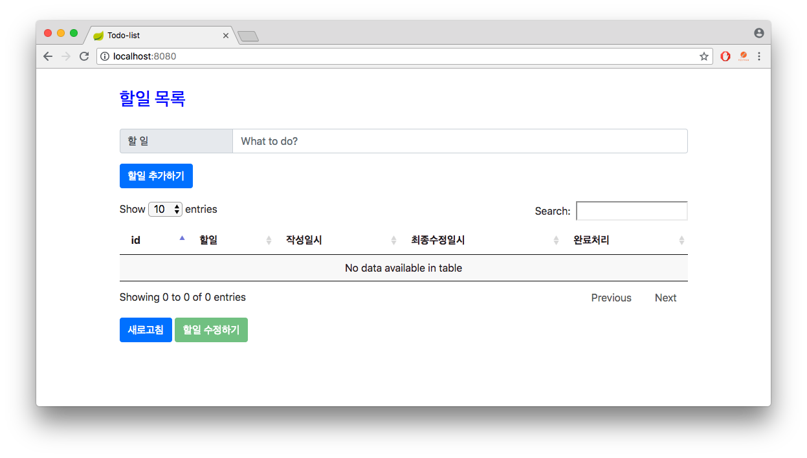

Todo List
=========

# Preview

# 개발 환경
* 서버 : Java (1.8+), Spring Boot Web Application
* 프론트엔드 : Html, Javascript (with jQuery, Bootstrap, DataTables)
* 데이터베이스 : Ignite (Local Cache Mode)
* 유닛테스트 : JUnit, Mockito, *(Javascript 는 처음 다뤄보아서 유닛테스트까지 진행하지 못함)*

# REST API
* JSON format
<pre><code>{
  "content" : "할일 내용",
  "complete" : false
}
</code></pre>

* **/api/todos/ (GET)**
  * 할일 목록을 모두 조회한다.
  
* **/api/todos/ (POST)**
  * 새로운 할일을 생성한다.
  
* **/api/todos/{id} (PUT)**
  * 기존 할일을 수정한다.

# 문제해결
* 서버
  * 서버는 Cache 에 할일 Object 을 Create, Read, Update 할 수 있다.
  * 할일 Object 는 id, content, createTime, updateTime, complete 의 다섯가지 속성을 가진다.
  * id 는 Ignite Cache 의 Sequence 를 사용하며, 새로운 할일을 생성할 때 하나씩 증가시킨다.
  * createTime, updateTime 은 새로운 할일을 생성할때 현재시간으로 설정한다.
  * updateTime 은 기존 할일을 수정할때 현재시간으로 설정한다.
  
* 프론트엔드
  * 할일을 조회할 수 있다. 조회는 기본적으로 할일을 생성, 수정한 이후에 자동으로 refresh 되며 새로고침 버튼으로도 가능하다.
  * 할일을 생성할 수 있다. 할일을 생성할 때에는 내용만 작성하며 완료여부는 미완료(false) 상태를 갖는다.
  * 할일을 생성할 때 내용에 입력된 참조 ID가 존재하는지 혹은 자기자신인지 확인해야 한다.
  * 할일을 수정할 수 있다. 수정되는 항목은 미완료 상태의 할일이며, 완료처리된 항목은 수정이 불가능하다.
  * 할일을 수정할 때 내용에 입력된 참조 ID 가 존재하는지 혹은 자기자신인지 확인해야 하며, 또한 이미 완료된 할일은 참조할 수 없다.
  * 할일을 완료처리할 때 자신을 참조하고있는 다른 할일이 있는지 확인해야 한다.
  
* 화면구성
  * 할일 추가하기
    + 화면 상단의 할일 입력창에 내용을 입력하고 아래 '할일 추가하기' 버튼을 눌러 새로운 할일을 추가한다.
      
      
  * 할일 수정하기
    - 조회된 테이블에서 수정하고자 할 할일을 선택하면 화면 아래 '할일 수정하기' 버튼이 활성화 되며,
      이 버튼을 눌러 팝업되는 화면에서 내용과 완료여부를 수정하고 '수정하기' 버튼을 눌러 수정을 완료하거나 '닫기' 버튼으로 취소한다.
      
      
  * 할일 조회하기
    - 기본적으로 추가/수정이 완료되면 데이터를 다시 조회한다.
      필요한 경우 화면 하단의 '새로고침' 버튼을 눌러 테이블의 내용을 다시 조회할 수 있다.

# 빌드 및 실행방법
* Maven Download: https://maven.apache.org/download.cgi
<pre><code>> git clone https://github.com/crazysense/kakao_exam_todo.git
> cd kakao_exam_todo
> git pull origin master
> mvn clean package
> cd target
> java -jar ./todo-0.1.jar [--server.port=9999]
</code></pre>

*실행시 --server.port 옵션을 주지 않으면 기본 8080 포트를 사용.*

# Web Console
<pre><code>http://localhost:8080</code></pre>

